# How-to-deploy-in-IBM-CodeEngine
The following steps are to help setting up a basic yet end-to-end flow for deploying code in IBM Code Engine.  

### Deploy an application on IBM Code Engine 

1. Login into [IBM Cloud](https://cloud.ibm.com/)
2. Got to Resource List 
3. Select Containers
4. Open Code Engine

    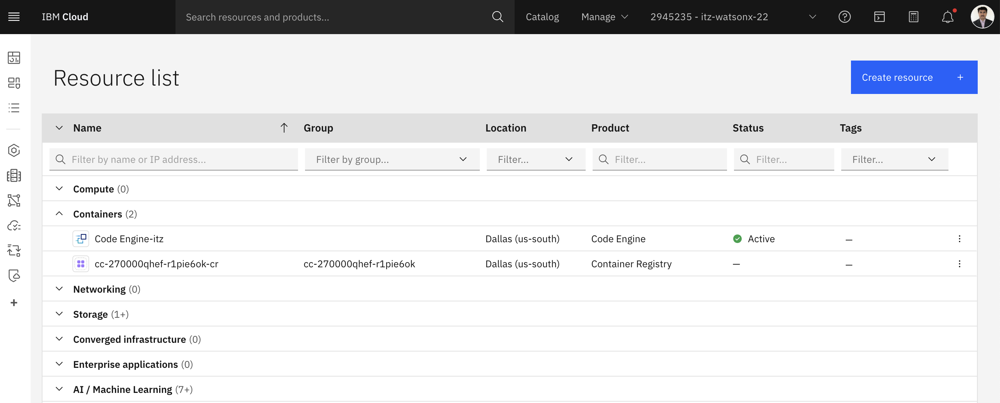

5. Go to Applications
6. Click on Create button
7. Provide an application name (e.g. deploy-docker-app).
8. Select "Build container image from source code" 
9. Clieck "Specify build Details"

    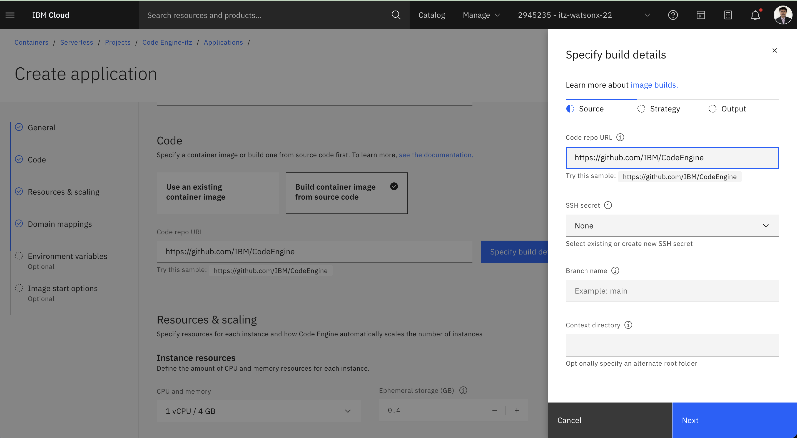

10. Provide code github ssh url in the 'Code repo url' field
11. Select/ Create SSH secret from the drop down, 
    
    incase not available, follow the section ***How to create github SSH key*** below
12. Click Next
13. Type Dockerfile under Dockerfile
14. Click Next
15. Under Registry Secret select Create registry secret
16. Provide a secret name for storing docker hub access token (e.g. suranjannandi-dockerhub)
     
     incase docker hub access token not available, follow the section ***How to create dockerhub Access Token*** below 
17. Provide a namespace name from dockerhub (e.g. suranjannandigmail)
     
     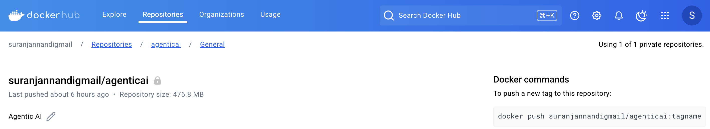
18. Add Repository name from dockerhub (e.g. agenticai)

     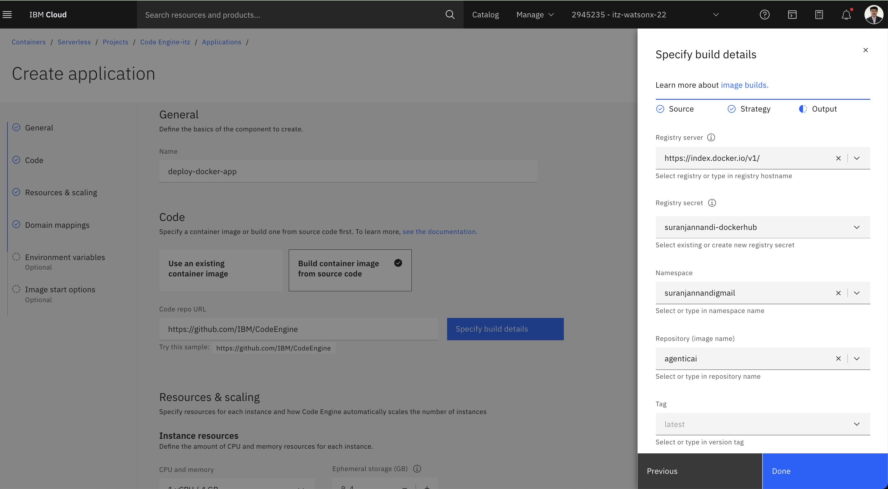

     incase docker hub repo is not available, follow the section ***How to create a repository in dockerhub*** below 

19. Set tag as latest 
20. Click Done, this will bring you in the main page
21. Review Resources & scaling, may continue with default or change as applicable
22. Review Domain mappings, may continue as Public
23. Set Environment variables, as per application requirement 
24. Click Create 

     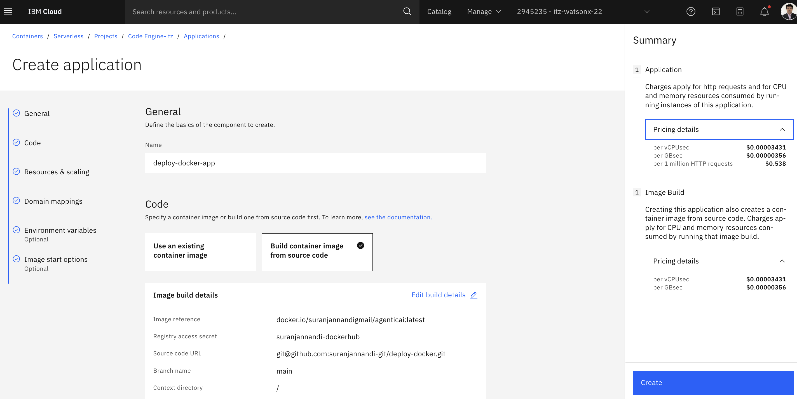

25. Expect the application build completion in few minutes

     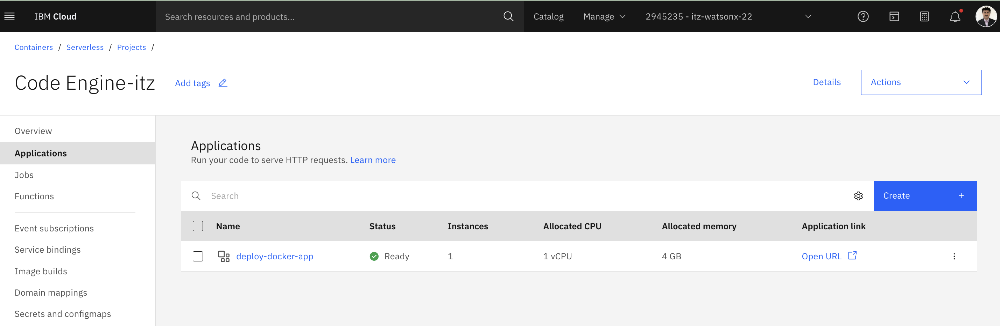

26. Rebuild and redeploy for any code change

    Perform a git checkin for any code changes

    Click Rerun build

     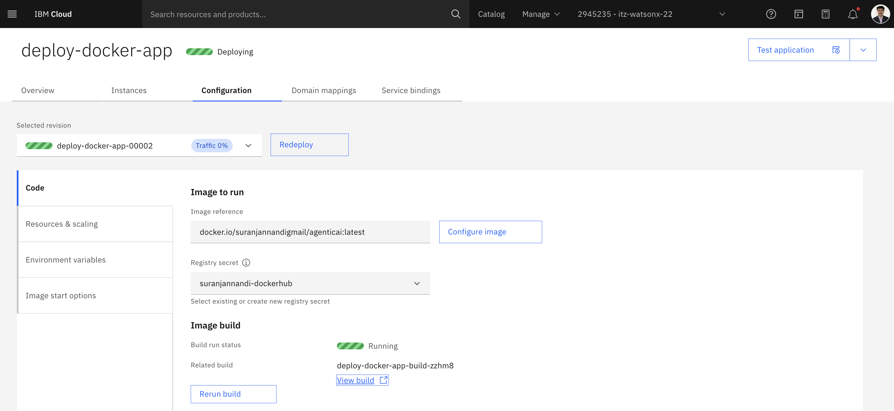

    Click Run Build and Reploy

     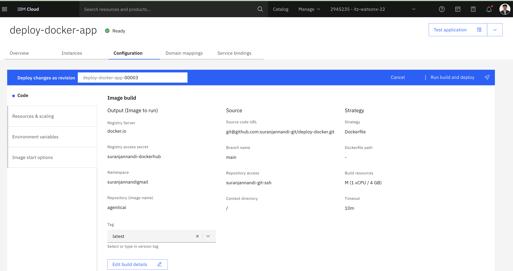

### How to create a repository in dockerhub
1. Login into https://hub.docker.com/, may use personal email     
2. Go to Repositories tab
3. Select Create a repository

     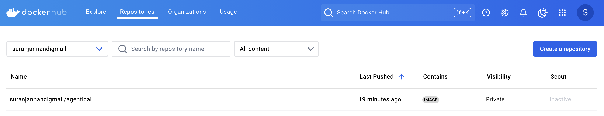

### How to create dockerhub Access Token
1. Login into https://hub.docker.com/, may use personal email     
2. Go to profile -> Account settings -> Personal Access Tokens
3. Click on *Generate new token*
4. Copy the userid and token password

    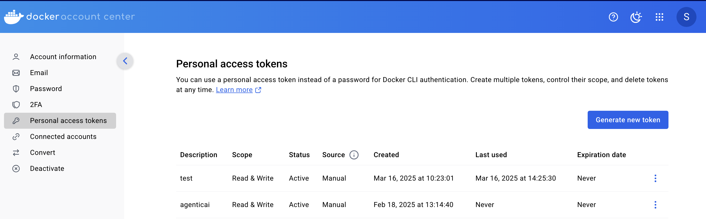

### How to create github SSH key
1. Open a new terminal window
2. Check if git cli is installed, if yes below command should show the version number
    
        git --version 
    
    install git, if not installed, 
    
        sudo apt-get install git
3.	Generate SSH Keys
    
        ssh-keygen -t rsa -b 4096 -C <your_email@example.com>
    
    This will create 2 key files, one private and one public under ~/.ssh folder
4.	Add SSH public key to github account
    
    Open IBM github https://github.ibm.com/settings/keys -> Settings -> SSH Key -> New SSH Key 
    
    Paste the content from SSH public key file and save
5.  Store the SSH private key file for future use
6.  This complete github SSH key creation

     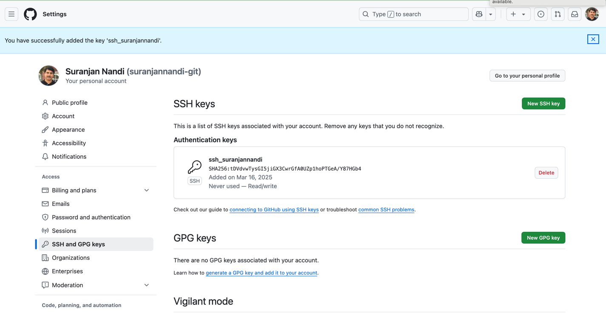

